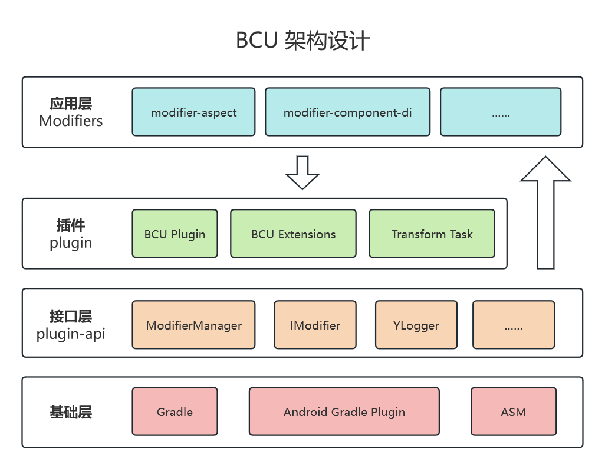

## BCU

本库是一个安卓平台上的基于 [ASM](https://asm.ow2.io/index.html) 实现的轻量级高性能字节码操作平台。目前已经 `AGP 8+`。

此外，本库从设计之初就考虑了 `Transform ` 过程对构建时间的影响，经过优化的转换流程和，配合缓存，增量，过滤机制，只为能减少你的等待时间。


### 功能&特性

- [x] v2 版已经支持 `AGP 7.4+`  |  ~~（v1 老版本是基于 `AGP4` 的 `Transform` 接口）~~
- [x] 支持过滤和增量，并优化 `Transform` 流程，合理配置过滤时能极大幅度缩减编译时间。
- [x] 插件内部多线程并行 IO 处理，提升编译速度。
- [x] 基于 `asm-tree`  实现的接口更加易于修改字节码。
- [x] 插件平台化，支持挂载多个字节码修改器，且使用多个修改器也只会有一次 IO 产生。
- [x] 提供了 `plugin-api` 供开发者实现自定义的字节码修改器，甚至不需要再去写 `Gradle` 插件。


### 了解&编译项目



- **BytecodeUtil**
  
  - `app` 用于演示的 application Demo
  - `demo1` 用于演示的 library Demo1
  - `buildSrc`  管理 maven 发布和版本控制
  - `repos` 的本地 maven 仓库，便于开发时调试
  - `lib_bcu_plugin`  插件工程编译时修改字节码在这里实现
    - `plugin-api`  插件对外提供的 API，基于此可实现自定义的字节码修改器
  - `lib_modifier_aspect`  用于实现 AOP 的字节码修改器
    - `aspect-api`  使用该修改器时，上层业务需要用到的接口
  - `lib_modifier_component_di` 用于实现组件依赖注入的字节码修改器
    - `component-di-api` 使用该修改器时，上层业务需要用到的接口
  
- **注意：在构建前先在项目根目录下执行该命令来生成插件**

  `gradlew publishAllPublicationsToLocalRepository`

- [了解 Gradle 和 Transform 点这（文章基于 AGP4）](https://blog.csdn.net/qq_35365635/article/details/120355777)


### 如何使用

#### Version & AGP & Gradle

[AGP 版本和 Gradle 版本关系点这里](https://developer.android.google.cn/studio/releases/gradle-plugin?hl=zh_cn#updating-gradle)

- v2 版本（**推荐使用**）
  - 基于 `AGP 8.1.1` 的 `variant#artifacts` 接口开发
  - `min AGP 7.4` ~ `max AGP 8+` 
  - 当使用 `AGP 7.4` 时最低应使用 `Gradle 7.5` 不能使用 `Gradle 8`
  - 当使用 `AGP 8+` 时最低应使用 `Gradle 8`
- v1 版本（**已经不维护**）
  - 基于 `AGP 4.1.3`  的 `Transform` 接口开发现在不推荐使用了
  - `min AGP 4.1.3`  ~ `max AGP 7.3`


#### 使用

1. 先在 release 中下载所需的 `repos.zip` 后在你的 `Gradle` 项目根目录下解压

2. 配置根目录下的 `build.gradle` 来使用解压中的 jar 包

   ```groovy
   // Top-level build file
   buildscript {
       // 解压的仓库地址
       ext.repos = uri('./repos')
       repositories {
       	// 使用仓库中的 jar
           maven { url repos }
           ... ...
       }
       dependencies {
       	... ...
           classpath "io.github.ysj001.bcu:plugin:<last version>"
       }
   }
   
   subprojects {
       repositories {
       	// 使用仓库中的 jar
           maven { url repos }
       	... ...
       }
   }
   // ===========================================
   // Android application build file
   apply plugin: 'com.android.application'
   // 使用 bcu 插件
   apply plugin: 'bcu-plugin'
   
   // 插件扩展
   bytecodeUtil {
       // 设置插件日志级别 （0 ~ 5）
       loggerLevel = 1
       // 挂载你所需的修改器，可以挂载多个，插件内部按顺序执行
       modifiers = [
           // 你要挂载的修改器的 class
           Class.forName("xxxxx")
   	]
       // 不需要处理的 class 文件过滤器。合理配置可提大幅升编译速度
       notNeed = { entryName ->
           // 这里传 false 表示不过滤
           false
       }
   }
   ```


#### 混淆配置

```text
-keepclassmembers class * {
    @com.ysj.lib.bytecodeutil.plugin.api.BCUKeep <methods>;
}
```


#### 性能

**// TODO**


#### Modifiers

- [modifier-aspect](lib_modifier_aspect/README.md) ：用于实现 AOP 的字节码修改器
- [modifier-component-di](lib_modifier_component_di/README.md) ：用于实现组件依赖注入的字节码修改器


### 其它

