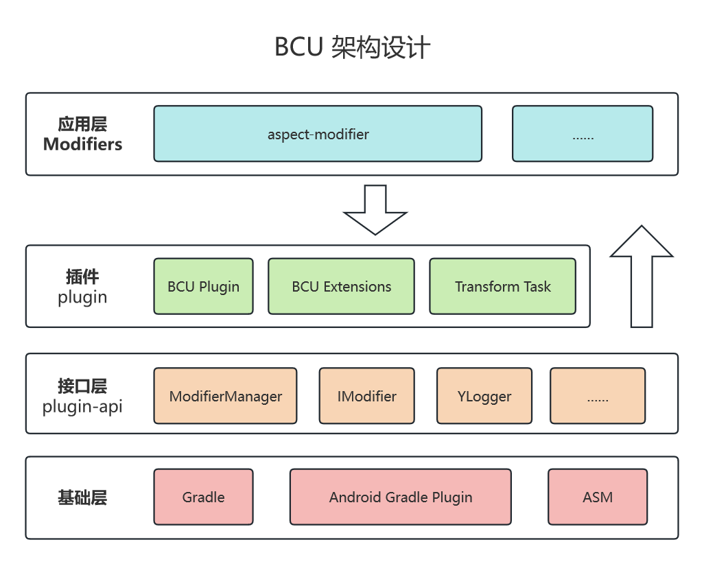

### BCU

本库是一个安卓平台上的基于 [ASM](https://asm.ow2.io/index.html) 实现的高性能轻量级字节码操作平台。

使用本库你只需要专注于如何修改字节码，不需要再去写 Gradle 插件和进行复杂且冗余的 IO 处理。

#### 功能&特性

- [x] 新版已经支持 `AGP 8+`  |  ~~（v1 老版本是基于 `AGP4` 的 `Transform` 接口）~~
- [x] 基于 `asm-tree`  实现的接口更加易于修改字节码。
- [x] 插件内部多线程并行 IO 处理，提升编译速度。
- [x] 插件平台化，支持挂载多个字节码修改器，且使用多个修改器也只会有一次 IO 产生。
- [x] 提供了 `plugin-api` 供开发者实现自定义的字节码修改器。
- [x] 提供了 `modifier-aspect` 可用于实现类似 `AspectJ` 的 `AOP` 功能，使安卓面向切面编程更简单！


#### 了解&编译项目



- **BytecodeUtil**
  
  - `app` 用于演示的 Demo
  - `buildSrc`  管理 maven 发布和版本控制
  - `repos` 的本地 maven 仓库，便于开发时调试
  - `lib_bcu_plugin`  插件工程编译时修改字节码在这里实现
    - `plugin-api`  插件对外提供的 API，基于此可实现自定义的字节码修改器
  - `lib_modifier_aspect`  用于实现 AOP 的字节码修改器
    - `aspect-api`  使用该修改器时，上层业务需要用到的接口
  
- **注意：在构建前先在项目根目录下执行该命令来生成插件**

  `gradlew publishAllPublicationsToLocalRepository`

- [了解 Gradle 和 Transform 点这（文章基于 AGP4）](https://blog.csdn.net/qq_35365635/article/details/120355777)


#### 如何使用

##### 依赖

由于发布到 mavenCentral 有点麻烦，目前先在 release 中下载。

1. 先在 release 中下载所需的代码包后在你的 Gradle 项目根目录下解压

2. 配置根目录下的 build.gradle 来使用解压中的 jar 包

   ```groovy
   // Top-level build file
   buildscript {
       // 解压的仓库地址
       ext.repos = uri('./repos')
       repositories {
       	// 使用仓库中的 jar
           maven { url repos }
           ... ...
       }
       dependencies {
       	... ...
           classpath "io.github.ysj001.bcu:plugin:<last version>"
       }
   }
   
   allprojects {
       repositories {
       	// 使用仓库中的 jar
           maven { url repos }
       	... ...
       }
   }
   ```

3. application 模块的 build.gradle 配置依赖

   ```groovy
   apply plugin: 'com.android.application'
   // 使用 bytecodeutil 插件
   apply plugin: 'bytecodeutil-plugin'
   
   // 插件扩展
   bytecodeUtil {
       // 设置插件日志级别
       loggerLevel = 1
       // 挂载你所需的修改器，可以挂载多个，插件内部按顺序执行
       modifiers = [
           // 你要挂载的修改器的 class
           Class.forName("xxxxx")
   	]
       // 不需要处理的 class 文件过滤器。合理配置可提升编译速度
       notNeed = { entryName ->
           // 这里传 false 表示不过滤
           false
       }
   }
   
   ```

##### 混淆配置

```text
-keepclassmembers class * {
    @com.ysj.lib.bytecodeutil.plugin.api.BCUKeep <methods>;
}
```

##### AOP

需要挂载该修改器：`com.ysj.lib.bcu.modifier.aspect.AspectModifier`

###### 介绍

Aspect Oriented Programming。面向切面编程，它的应用是指在不修改源代码的情况下给程序动态添加功能，并将这个功能统一横切到一处统一处理的一种编程方式，能充分体现了高内聚低耦合的编程思想。

###### 案例（DEMO）

- 演示在 MainActivity 的 onCreate 函数体开头插入如下打印 log 的方法

  ```kotlin
  // 使用该注解标识该类是切面类
  @Aspect
  object AopTest {
      // 使用该注解标识该方法是一个切入点方法，该方法会被织入到指定
      @Pointcut(
          target = "class:.*MainActivity",
          funName = "onCreate",
          funDesc = "\\(Landroid/os/Bundle;\\)V",
          position = POSITION_START, // 设置织入到目标方法的开头
      )
      fun log(jp: JoinPoint /* 可以拿到织入的目标方法的参数等 */) {
          Log.i(TAG, "捕获到: ${jp.target} args:${jp.args}")
      }
  }
  ```
  
- 演示代理任意使用了 IntervalTrigger 注解的方法实现间隔触发

  ```kotlin
  // 自定义一个间隔触发的注解
  @Target(AnnotationTarget.FUNCTION)
  @Retention(AnnotationRetention.RUNTIME)
  annotation class IntervalTrigger(
      val intervalMS: Long = 1000
  )
  
  @Aspect
  object AopTest {
      var oldTriggerTime = 0L
      @Pointcut(
          target = "annotation:L.*IntervalTrigger;",
          position = POSITION_CALL, // 设置在调用位置代理源方法
      )
      fun log(callingPoint: CallingPoint) {
          val trigger = callingPoint.annotation(IntervalTrigger::class.java) ?: return
          val currentTimeMillis = System.currentTimeMillis()
          if (currentTimeMillis - oldTriggerTime < trigger.intervalMS) {
              Log.i(TAG, "log5: 禁止触发")
              return
          }
          oldTriggerTime = currentTimeMillis
          Log.i(TAG, "log5: 成功触发")
          callingPoint.call()
      }
  }
  
  // 如下：
  class MainActivity : AppCompatActivity() {
      @LogPositionReturn
      override fun onCreate(savedInstanceState: Bundle?) {
          super.onCreate(savedInstanceState)
          setContentView(R.layout.activity_main)
          findViewById<View>(R.id.test).setOnClickListener {
              test3()
          }
      }
  
      @IntervalTrigger(500)
      private fun test3() {
          // todo something
      }
  }
  ```

